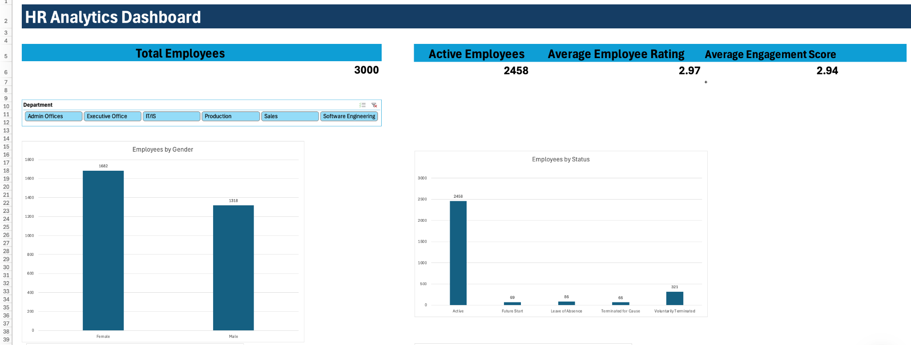
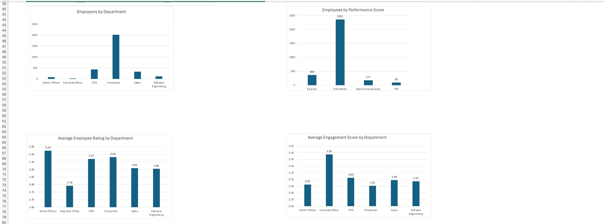

# Workforce & Employee Analytics Dashboard

## Project Overview

This project analyzes workforce and employee data using Microsoft Excel to identify trends in employee demographics, employment status, performance, engagement, satisfaction, work-life balance, and training.

The dataset contains 3,000 employee records. I cleaned and validated the data, created PivotTables to analyze key HR metrics, and developed an interactive HR Analytics Dashboard using KPI cards, charts, and a Department slicer.

The dashboard allows users to filter the analysis by department and dynamically explore key workforce metrics.

## Project Objectives

- Analyze the overall workforce and active employee population.
- Understand employee distribution across departments and gender.
- Analyze employee performance and engagement.
- Compare employee ratings across departments.
- Examine employee satisfaction and work-life balance.
- Analyze employee participation in training programs and training costs.
- Build an interactive Excel dashboard for easier HR analysis.

## Tools Used

- Microsoft Excel
- Excel formulas
- Data cleaning and validation
- PivotTables
- PivotCharts
- KPI calculations
- Slicers
- Interactive dashboard development

## Key KPIs

- **Total Employees:** 3,000
- **Active Employees:** 2,458
- **Average Employee Rating:** 2.97
- **Average Engagement Score:** 2.94

## Dashboard

### Dashboard Overview

### Detailed Analysis

## Data Cleaning & Preparation

Before building the dashboard, the dataset was cleaned and validated in Microsoft Excel to improve data quality and consistency.

- Checked the dataset for duplicate employee records and removed duplicates where necessary.
- Checked important columns for missing or blank values.
- Standardized and validated date fields such as Date of Birth, Start Date, Survey Date, and Training Date.
- Cleaned text fields by removing unnecessary spaces and correcting inconsistent values.
- Reviewed employee status, termination type, and termination description fields to ensure blank or unknown values were interpreted appropriately.
- Validated Employee IDs and other important employee information for consistency.
- Prepared the cleaned dataset for PivotTable analysis and dashboard development.

## Key Insights

- **Workforce Status:** Out of 3,000 employees, 2,458 are currently active, representing approximately 82% of the workforce.

- **Gender Distribution:** The workforce consists of 1,682 female employees and 1,318 male employees, with female employees representing the larger group.

- **Department Distribution:** Production is the largest department with 2,020 employees, accounting for approximately 67% of the total workforce.

- **Employee Performance:** Most employees (2,361) received a "Fully Meets" performance rating, while 369 exceeded expectations, 177 needed improvement, and 93 were on a Performance Improvement Plan (PIP).

- **Employee Rating:** The overall average employee rating is 2.97. Admin Offices has the highest departmental average rating at 3.03.

- **Employee Engagement:** The overall average engagement score is 2.94. Executive Office has the highest engagement score at 3.38, while Production has the lowest at 2.91.

- **Employee Satisfaction:** Sales has the highest average satisfaction score at 3.13, while Admin Offices has the lowest at 2.51.

- **Work-Life Balance:** Executive Office has the highest average work-life balance score at 3.29, while Production has the lowest at 2.96.

- **Training:** Communication Skills has the highest employee participation with 673 employees, while Customer Service has the highest average training cost at $567.39.

## Project Files

- **Workforce_Employee_Analytics.xlsx** – Complete Excel workbook containing the cleaned dataset, PivotTables, analysis, and interactive HR Analytics Dashboard.
- **HR_Analytics_Dashboard_Overview.png** – Screenshot showing the main dashboard KPIs, Department slicer, employee gender distribution, and employee status.
- **HR_Analytics_Dashboard_Analysis.png** – Screenshot showing detailed analysis of department distribution, employee performance, employee ratings, and engagement.
